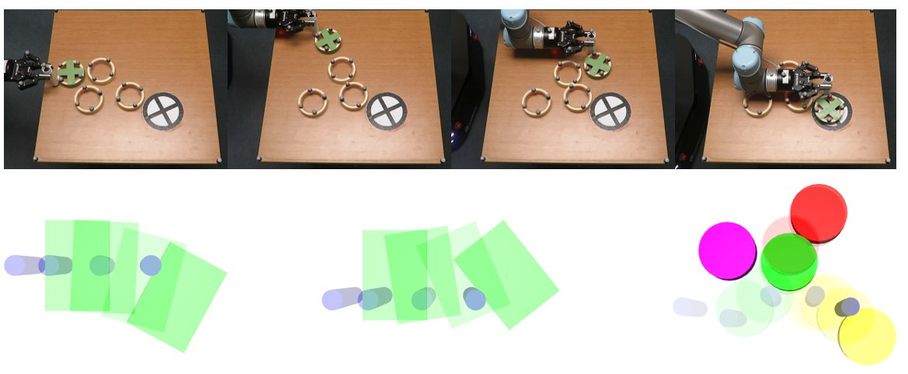

# Parareal for Robotic Manipulation

A key component of many robotics model-based planning and control algorithms is physics predictions, that is, forecasting a sequence of states given an initial state and a sequence of controls. This process is slow and a major computational bottleneck for robotics planning algorithms.

Parallel-in-time integration methods such as Parareal can help to leverage parallel computing to accelerate physics predictions and thus planning.

The Parareal algorithm iterates between a coarse serial model and a fine parallel model. A key
challenge is to devise a coarse level model that is computationally cheap but accurate enough for Parareal
to converge quickly. 

We propose two coarse physics models for robotic pushing: An analytical and a deep neural network physics model. We use the Mujoco physics engine as the fine model. These accelerated physics predictions are then used for robotic push planning and control. 

Here, we provide the source code for our implementation. 

More information can be found in our conference paper [ISRR 2019](https://arxiv.org/abs/1903.08470) and journal article [CVS 2020](https://arxiv.org/abs/1912.05958) (Conditionally accepted).

 

## Getting Started

	1. Create and activate a virtual environment (Code was tested with Ubuntu 16.04 and python3.5)
		$  virtualenv -p /usr/bin/python3.5 venv ; source venv/bin/activate

	2. Install Physics Simulator Mujoco and dm_control in virtual env 
		Follow instructions from Deepmind's dm_control project https://github.com/deepmind/dm_control.

	3. Install other required python packages 
		$  pip install numpy pandas pyquaternion shapely matplotlib IPython tensorflow==2.0.0-beta1 pillow
	
	4. Clone this repo 
		$ git clone ...

	4. Run setup.py to place custom domains into 'suite'
		$  python3.5 setup/setup.py 

	5. Generate data to train neural network (skip to use existing model)
		$  python3.5 data_generator.py  # outputs data files like 'discrete_ms.csv' and 'random_ms.csv'

	6. Train neural network (skip to use existing model) 
		$ python3.5 train_model.py  # uses step 5 data and outputs 'model_weights.h5'.

	7. Test neural network model (skip to use existing model)
		$  python3.5 test_model.py  # uses trained model and test data to compute prediction error. 

## Running experiments

We use coarse models (analytical and learned) and fine model (Mujoco) with Parareal for physics predictions of robotic pushing actions. 

	1. Generate experimental data
		$ bash run_experiment.sh 

	2. Generate results: plots, frames, text files. 
 		$ bash plot_generation.sh 

Alternatively skip step 1 and extract data into the project directory. Data is on Dropbox [here](https://www.dropbox.com/s/2arko70bhzc9t9m/exp_dataset.zip?dl=0) (170 MB). 

## Citation
If you find the code useful please consider citing our paper at [ISRR 2019](https://arxiv.org/abs/1903.08470) 

	@inproceedings{Agboh_ISRR19,
	  author    = {Wisdom C. Agboh and
		       Daniel Ruprecht and
		       Mehmet R. Dogar},
	  title     = {Combining Coarse and Fine Physics for Manipulation using Parallel-in-Time
		       Integration},
	  journal   = {International Symposium on Robotics Research},
	  year      = {2019}
	}

**and** our journal article [CVS 2020](https://arxiv.org/abs/1912.05958) (Conditionally accepted)

	@article{Agboh_CVS20,
	  author    = {Wisdom C. Agboh and
		       Oliver Grainger and 
		       Daniel Ruprecht and
		       Mehmet R. Dogar},
	  title     = {Parareal with a Learned Coarse Model for Robotic Manipulation},
	  journal   = {Computing and Visualization in Science},
	  year      = {2020}
	}

## Watch videos

[ISRR 2019](https://youtu.be/5e9oTeu4JOU) 

[CVS 2020](https://youtu.be/wCh2o1rf-gA)

## Have a question?
For all queries please contact Wisdom Agboh (wisdomagboh@gmail.com) or Oliver Grainger (mn17omg@leeds.ac.uk
)

## License
This project is licensed under the MIT License - see the 
[LICENSE.md](LICENSE.md) file for details.
