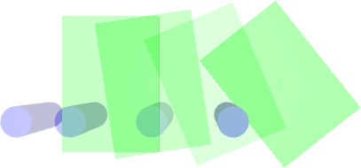

# Parareal for Robotic Manipulation

A key component of many robotics model-based planning and control algorithms is physics predictions, that is, forecasting a sequence of states given an initial state and a sequence of controls. This process is slow and a major computational bottleneck for robotics planning algorithms.

Parallel-in-time integration methods such as Parareal can help to leverage parallel computing to accelerate physics predictions and thus planning.

We propose combining a coarse (i.e. computationally cheap but not very accurate) predictive physics model, with a fine (i.e. computationally expensive but accurate) predictive physics model, to generate a hybrid model that is at the required speed and accuracy for a given manipulation task.

The Parareal algorithm iterates between a coarse serial integrator and a fine parallel integrator. A key
challenge is to devise a coarse level model that is computationally cheap but accurate enough for Parareal
to converge quickly. 

We propose two coarse physics models for robotic pushing --- An analytical and a deep neural network physics model. We use the Mujoco physics engine as the fine model. 

Here, we provide the source code for our implementation. 

More information can be found in our papers [ISRR 2019](https://arxiv.org/abs/1903.08470) and [JCVS 2020 (Conditionally Accepted)](https://arxiv.org/abs/1912.05958)

## Getting Started

These instructions will get you a copy of the project up and running on 
your local machine for development and testing purposes. 

### Prerequisites

Mujoco 

## Running experiments, training and testing

 
## Citation
If you find the code useful in your research, please consider citing [ISRR 2019](https://arxiv.org/abs/1903.08470) 

@inproceedings{agboh_isrr19,
  author    = {Wisdom C. Agboh and
               Daniel Ruprecht and
               Mehmet R. Dogar},
  title     = {Combining Coarse and Fine Physics for Manipulation using Parallel-in-Time
               Integration},
  journal   = {International Symposium on Robotics Research},
  year      = {2019}
}

and [JCVS 2020 (Conditionally Accepted)](https://arxiv.org/abs/1912.05958)

@article{agboh_jcvs20,
  author    = {Wisdom C. Agboh and
               Oliver Grainger and 
               Daniel Ruprecht and
               Mehmet R. Dogar},
  title     = {Parareal with a Learned Coarse Model for Robotic Manipulation},
  journal   = {Journal of Computing and Visualization in Science},
  year      = {2020}
}

## Watch a video

 

## Have a question?
For all queries please contact Wisdom Agboh (wisdomagboh@gmail.com).

## License
This project is licensed under the MIT License - see the 
[LICENSE.md](LICENSE.md) file for details.
